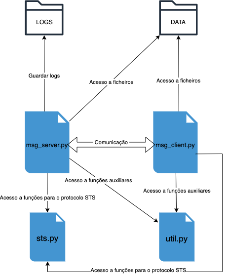

# Relatório TP1 - SSI: Grupo 5

## Introdução
O presente relatório visa a descrição deste primeiro trabalho pratico no qual é proposto a construção de um serviço de Message Relay destinado a facilitar a comunicação entre os membros de uma organização. Esse serviço será viabilizado por um servidor central responsável por manter o estado da aplicação e facilitar a interação entre os utilizadores e o sistema.

Essencialmente, o projeto baseia-se na integração de diferentes componentes criptográficas desenvolvidas ao longo das aulas práticas, no sentido de atender aos requisitos definidos para o sistema. Este relatório detalhará então o processo de concepção, implementação e funcionamento do serviço de Message Relay, destacando os principais desafios técnicos enfrentados e as soluções adotadas para superá-los.

## Objetivos
O objetivo primordial do trabalho passa por fornecer uma plataforma na qual os utilizadores possam trocar mensagens com garantias de autenticidade.
A infraestrutura proposta tem de lidar com a identificação inequívoca de todos os intervenientes do sistema, sejam eles utilizadores ou o próprio servidor deste modo a cada interveniente deverá associado a um identificador único.

Além disso, é essencial confiar no servidor para atribuir timestamps às mensagens recebidas, sem comprometer a confidencialidade das mensagens tratadas. No entanto, é crucial que o servidor não possa manipular o conteúdo ou o destino das mensagens tratadas.
Relativamente aos clientes, devem ser capazes de garantir que estas foram enviadas pelo remetente especificado e são destinadas a eles. No caso de falha na verificação, o sistema deve fornecer mensagens de erro apropriadas.

## Arquitetura do sistema


## Implementação do sistema

### Autenticação e certificação
A implementação da autenticação e certificação dos utilizadores segue um protocolo baseado Station-to-Station, que utiliza o protocolo Diffie-Hellman para estabelecer uma chave partilhada entre o cliente e o servidor. O cliente envia a sua chave pública ao servidor, juntamente com seu certificado, que é usado para validar sua identidade. Em resposta, o servidor envia seu próprio certificado para o cliente, que também é verificado para garantir a autenticidade do servidor.

```python
# Cliente:
self.public_key = parameters.generate_private_key().public_key()
self.user_cert = load_user_certificate('client_cert.pem')

# Servidor:
self.server_cert = load_server_certificate('server_cert.pem')
```

Ambos os lados validam os certificados recebidos para garantir a autenticidade e integridade dos mesmos. Isso envolve verificar a assinatura digital dos certificados e garantir que estes estejam dentro do período de validade, além de verificar se foram emitidos por uma autoridade certificadora confiável.

Após a troca de certificados, tanto o cliente quanto o servidor executam o protocolo Diffie-Hellman para calcular uma chave partilhada.
O cliente gera uma chave privada DH localmente, calcula a chave pública correspondente e a envia para o servidor. O mesmo processo se repete no servidor.

```python
# Cliente
self.public_key = parameters.generate_private_key().public_key()

# Servidor
self.public_key = parameters.generate_private_key().public_key()
```

Após a troca de chaves públicas, ambas as partes calculam uma chave partilhada e utilizam essa chave como entrada para um processo de derivação de chave (HKDF), resultando numa chave simétrica.

```python
# Cliente
shared_key = self.private_key.exchange(server_public_key)
derived_key = HKDF(...).derive(shared_key)

# Servidor
shared_key = self.private_key.exchange(client_public_key)
derived_key = HKDF(...).derive(shared_key)
```

O cliente assina uma mensagem com sua chave privada e envia ao servidor para autenticação. O servidor verifica a assinatura usando a chave pública do cliente.

```python
# Cliente
signature = private_key.sign(message, ...)

# Servidor
public_key.verify(signature, message, ...)
```

Este processo garante que tanto o cliente quanto o servidor estejam confiantes nas identidades uns dos outros e que a comunicação entre eles seja protegida contra interceptação e adulteração, garantindo a segurança e a integridade das mensagens trocadas. 

### Troca de mensgaens
A função load_public_keys devolve um dicionário com as chaves públicas. Esta função é chamada antes do processo de envio de mensagens para garantir que as chaves públicas estejam carregadas e prontas para uso.

```python
def load_public_keys():
    public_keys = {}
    p12_files = [f for f in os.listdir() if f.startswith('MSG_CLI') and f.endswith('.p12')]
    
    for p12_file in p12_files:
        user_data = get_userdata(p12_file)
        user_cert = user_data[1]
        
        for attr in user_cert.subject:
            if attr.oid == x509.NameOID.PSEUDONYM:
                user_id = attr.value
        
        public_keys[user_id] = user_cert.public_key()
    
    return public_keys
```

Após carregar as chaves públicas, o cliente prepara uma mensagem em formato BSON contendo o conteúdo da mensagem, como o destinatário, o assunto e o corpo da mensagem. A mensagem é convertida em bytes e criptografada usando um esquema de criptografia simétrica (AES-GCM) com a chave derivada estabelecida anteriormente.

```python
# Cliente
message = {
    "recipient": "alice",
    "subject": "Hello",
    "body": "This is a secure message."
}

encrypted_message = aes_gcm_encrypt(derived_key, json.dumps(message))

send_message(encrypted_message)
```

O cliente então cifra a mensagem com a chave pública do destinatário e assina o conteúdo com sua chave privada. Assim, quando o destinatário receber a mensagem, poderá verificar que foi de fato o remetente quem cifrou e enviou a mensagem.
```python
# Cliente
enc_content = public_keys[uid].encrypt(
                    content,
                    padding.OAEP(
                        mgf=padding.MGF1(algorithm=hashes.SHA256()),
                        algorithm=hashes.SHA256(),
                        label=None
                    )
                )
signature = private_key.sign(
                    enc_content,
                    padding.PSS(
                        mgf=padding.MGF1(hashes.SHA256()),
                        salt_length=padding.PSS.MAX_LENGTH
                    ),
                    hashes.SHA256()
                )
```

A mensagem cifrada e assinada é enviada ao servidor. Este, ao receber a mensagem criptografada do cliente, a descriptografa usando a chave derivada. Após descriptografar a mensagem, o servidor processa o conteúdo da mensagem conforme necessário.

```python
# Servidor
encrypted_message = receive_message()

decrypted_message = aes_gcm_decrypt(derived_key, encrypted_message)

process_message(json.loads(decrypted_message))
```

O servidor também pode enviar uma resposta ao cliente, seguindo um processo semelhante. A resposta é criptografada usando a mesma chave derivada e assinada com a chave privada do servidor. A comunicação entre o cliente e o servidor continua conforme necessário, com as mensagens sendo trocadas de forma segura utilizando a chave derivada estabelecida durante a autenticação inicial.

```python
# Servidor
response_message = {
    "status": "Message received"
}

encrypted_response = aes_gcm_encrypt(derived_key, json.dumps(response_message))

send_message(encrypted_response)
```

### Comandos da aplicação cliente

#### `-user <FNAME>`
Quando o utilizador executa o comando `-user <FNAME>`, o cliente é resposável por carregar os dados do utilizador do arquivo especificado.
```python
private_key, user_cert, ca_cert = get_userdata('MSG_CLI1.p12')
```
get_userdata('MSG_CLI1.p12') é uma função que carrega os dados do utilizador a partir do arquivo 'MSG_CLI1.p12', que inclui uma chave privada, um certificado de utilizador e um certificado de autoridade.

Os dados do utilizador, incluindo a chave privada e o certificado de utilizador, são usados para autenticar e estabelecer uma comunicação segura com o servidor. Aqui, a chave privada é, da mesma forma, usada para assinar uma mensagem antes de ser enviada ao servidor, garantindo assim a autenticidade da mensagem.
```python
signature = private_key.sign(message, padding.PSS(...))
```

No início do servidor, os dados do utilizador são carregados usando a função get_userdata() da mesma forma que no cliente. Esses dados incluem uma chave privada, um certificado do servidor e um certificado de autoridade (CA). A chave privada é usada para estabelecer uma comunicação segura com os clientes.
```pyhton
private_key, server_cert, ca_cert = get_userdata('MSG_SERVER.p12')
```

Os certificados (tanto do servidor quanto o CA) são usados para verificar a autenticidade das chaves públicas trocadas durante o protocolo Station-to-Station entre o servidor e o cliente. Isso garante que a comunicação seja segura e autenticada.
```python
server_cert.verify_directly_issued_by(ca_cert)
```

Durante o protocolo Station-to-Station, o servidor e o cliente trocam as chaves públicas e realizam um acordo de chave Diffie-Hellman para estabelecer uma chave partilhada. Essa chave partilhada é usada para criptografar as comunicações subsequentes entre o servidor e o cliente.
```python
shared_key = self.private_key.exchange(server_public_key)
```

#### `send <UID> <SUBJECT>`
Quando o utilizador executa o comando send, o cliente solicita que insira o conteúdo da mensagem.
Esse conteúdo é então encriptado utilizando a chave pública do destinatário, garantindo que apenas o destinatário possa ler a mensagem.
O algoritmo de encriptação utilizado é o OAEP (Optimal Asymmetric Encryption Padding), que oferece segurança e integridade ao processo de encriptação.

```python
enc_content = public_keys[uid].encrypt(
    content,
    padding.OAEP(
        mgf=padding.MGF1(algorithm=hashes.SHA256()),
        algorithm=hashes.SHA256(),
        label=None
    )
)
```

Após a encriptação do conteúdo da mensagem, o cliente assina a mensagem encriptada usando a sua própria chave privada.
A assinatura é gerada utilizando o algoritmo de assinatura PSS (Probabilistic Signature Scheme), que garante a autenticidade da mensagem e protege contra adulterações durante a transmissão.
```python
signature = private_key.sign(
    enc_content,
    padding.PSS(
        mgf=padding.MGF1(hashes.SHA256()),
        salt_length=padding.PSS.MAX_LENGTH
    ),
    hashes.SHA256()
)
```

Com o conteúdo da mensagem encriptado e assinado, o cliente constrói a estrutura da mensagem que será enviada ao servidor.
Essa estrutura inclui o comando 'send', o identificador do destinatário, o assunto da mensagem, o conteúdo encriptado e a assinatura
```python
message = {
    "command"   : 'send',
    "uid"       : uid,
    "subject"   : subject,
    "content"   : enc_content,
    "signature" : signature
}
```

Após a construção da mensagem, ela é enviada ao servidor para ser entregue ao destinatário.
O servidor receberá a mensagem, verificará a autenticidade da assinatura e, em seguida, desencriptará o conteúdo antes de colocá-lo na fila do destinatário para posterior leitura.
```python
new_msg = bson.dumps(message)
```

#### `askqueue`
Quando o utilizador executa o comando askqueue, o cliente envia uma solicitação ao servidor para obter a lista de mensagens não lidas na fila do utilizador.
Isso é feito enviando uma mensagem ao servidor com o comando askqueue
```python
message = {
    "command" : 'askqueue',
}
new_msg = bson.dumps(message)
```

O servidor processa a solicitação e verifica a fila do utilizador à procura de mensagens não lidas.
Se houver mensagens não lidas, ele compila uma lista dessas mensagens e envia essa lista como resposta ao cliente. Caso contrário, ele envia uma mensagem indicando que não há mensagens não lidas disponíveis.
```python
if content:
    new_msg = bson.dumps({
        "command" : 'askqueue',
        "content" : content
    })
else:
    new_msg = bson.dumps({
        "command" : 'askqueue',
        "content" : 'There are no new messages'
    })
```

O cliente aguarda a resposta do servidor.
Ao receber a resposta, ele verifica se há mensagens não lidas disponíveis ou se recebe uma mensagem indicando que não há mensagens não lidas disponíveis.
```python
msg = await reader.read(max_msg_size)
if msg:
    txt = bson.loads(msg)
    if txt['command'] == 'askqueue':
        if txt['content'] == 'There are no new messages':
            print("There are no new messages")
```

Se houver mensagens não lidas disponíveis, o cliente processa a lista de mensagens recebida do servidor.
Ele exibe essas mensagens na interface do utilizador para que o utilizador possa ver quais mensagens estão disponíveis na sua fila.
```python
for message in queue_messages:
    print(f"{message['num']}:{message['sender']}:{message['time']}:{message['subject']}")

```

#### `getmsg <NUM>`
Quando o utilizador executa o comando getmsg, o cliente envia uma solicitação ao servidor para obter a mensagem específica com o número fornecido.
```python
message = {
    "command" : 'getmsg',
    "num"     : num
}
new_msg = bson.dumps(message)
```

O servidor processa a solicitação e verifica se a mensagem com o número fornecido está disponível na fila do utilizador.
Se a mensagem estiver disponível, ele a compila como resposta ao cliente. Caso contrário, ele envia uma mensagem indicando que o número fornecido não corresponde a uma mensagem na fila do utilizador.
```python
if 1 <= num <= len(queue_messages):
    message = queue_messages[num - 1]
else:
    new_msg = bson.dumps({
        "command" : 'getmsg',
        "content" : 'Number not found on queue'
    })

```

O cliente aguarda a resposta do servidor.
Ao receber a resposta, ele verifica se a mensagem solicitada está disponível na fila do utilizador.
```python
msg = await reader.read(max_msg_size)
if msg:
    txt = bson.loads(msg)
    if txt['command'] == 'getmsg':
        if 'content' in txt and txt['content'] == 'Number not found on queue':
            print("Number not found on queue")
```

Se a mensagem solicitada estiver disponível, o cliente processa a mensagem recebida do servidor.
Ele exibe o conteúdo da mensagem na interface do utilizador para que este possa ler a mensagem.
```python
print(f"Sender: {message['sender']}")
print(f"Time: {message['time']}")
print(f"Subject: {message['subject']}")
print(f"Content: {message['content']}")
```

#### `help`
Quando o utilizador executa o comando help, o cliente chama a função print_info() para exibir as instruções de uso na interface do utilizador.

## Funcionalidades Implementadas

### Comunicação protegida contra acesso ilegítimo e/ou manipulação:
Para garantir a segurança da comunicação entre o cliente e o servidor, é implementado o protocolo Station-to-Station, protocolo este que é fundamental para estabelecer uma autenticação mútua e derivar uma chave de sessão segura.

No lado do cliente, quando o msg_cnt tem o valor de 1, o cliente envia sua chave pública para o servidor, isso permite iniciar o processo de autenticação. Na segunda etapa do protocolo, o cliente recebe a resposta do servidor. Nesse momento, ocorre a validação do certificado do servidor, garantindo que o cliente esteja a comunicar com a entidade correta. Além disso, é realizada a derivação da chave de sessão, essencial para criptografar e pro teger as comunicações seguintes.

No lado do servidor, quando msg_cnt é igual a 1, este recebe a chave pública do cliente. A partir disso, é possível validar o certificado do mesmo, garantindo a legitimidade da comunicação. De seguida, é realizada a derivação da chave de sessão de maneira a assegurar a confidencialidade e integridade das mensagens trocadas.

### Confidencialidade das mensagens:
A confidencialidade das mensagens é garantida pela criptografia end-to-end, onde as mensagens são criptografadas pelo cliente e só podem ser decifradas pelo destinatário correto, o servidor.

No cliente e no servidor, durante a segunda etapa do protocolo STS, ocorre a validação do certificado do remetente, esse processo verifica a autenticidade do mesmo. A chave de sessão é derivada, permitindo que as mensagens sejam criptografadas de forma segura para garantir sua confidencialidade durante a transmissão.


### Verificação de mensagens quanto ao remetente e destinatário e mensagens de erro:
No cliente, acontece ao processar mensagens recebidas na função process(). Para a operação getmsg, o cliente verifica a assinatura da mensagem recebida, garantindo assim que a mensagem foi enviada pelo remetente especificado. Esse processo é fundamental para evitar falsificação de identidade e garantir a autenticidade das mensagens recebidas.

No servidor, para a operação send, o servidor armazena a mensagem na fila associada ao destinatário especificado. Essa abordagem garante que as mensagens sejam entregues apenas aos destinatários corretos.

Quando a mensagem pedida não existe na fila do utilizador ou no caso de falha da verificação da mensagem são devolvidas as respetivas mensagens de erro

```python 
else:
    # Caso o número da mensagem não exista na fila do utilizador
    sys.stderr.write('MSG RELAY SERVICE: unknown message!\n')
    return b''
```

```python 
except InvalidSignature:
        # Em caso de falha na verificação da assinatura
        sys.stderr.write('MSG RELAY SERVICE: verification error!\n')
```

### Suporte da componente de certificação

Para a gerar os certificados de autoridade (CA) começamos por gerar uma chave privada RSA que irá ser armazendada no seu respetivo arquivo. 

```python
with open("data/MSG_CA.key", "wb") as f:
    f.write(key.private_bytes(
        encoding=serialization.Encoding.PEM,
        format=serialization.PrivateFormat.TraditionalOpenSSL,
        encryption_algorithm=serialization.BestAvailableEncryption(b"1234"),
    ))
```
Após isso e através da biblioteca cryptography.x509 o certificado é construído. É definido o assunto e o emissor do certificado, a chave pública, um serial number aleatório, a data de validade e adicionadas extensões. A assinatura é obtida através da chave privada criada anteriormente.

```python
cert = x509.CertificateBuilder().subject_name(
    subject
).issuer_name(
    issuer
).public_key(
    key.public_key()
).serial_number(
    x509.random_serial_number()
).not_valid_before(
    datetime.datetime.now(datetime.timezone.utc)
).not_valid_after(
    datetime.datetime.now(datetime.timezone.utc) + datetime.timedelta(days=10)
).add_extension(
    x509.BasicConstraints(ca=True, path_length=None),
    critical=True,
).add_extension(
    x509.KeyUsage(
        # Permissões da chave ...
    ),
    critical=True,
).sign(key, hashes.SHA256())
```


Para os certificados do cliente é usado o certificado CA gerado anteriormente. Da mesma maneira é criada e armazenada uma chave privada RSA, é definido o assunto e o emissor do certificado, a chave pública, um serial number aleatório, a data de validade e adicionadas extensões.

```python
cert = x509.CertificateBuilder().subject_name(
    subject
).issuer_name(
    issuer
).public_key(
    key.public_key()
).serial_number(
    x509.random_serial_number()
).not_valid_before(
    datetime.datetime.now(datetime.timezone.utc)
).not_valid_after(
    datetime.datetime.now(datetime.timezone.utc) + datetime.timedelta(days=10)
).add_extension(
    x509.BasicConstraints(ca=False, path_length=None),
    critical=True,
).add_extension(
    x509.KeyUsage(
        # Permissões de chave...
    ),
    critical=True,
).add_extension(
    x509.ExtendedKeyUsage([
        x509.oid.ExtendedKeyUsageOID.CLIENT_AUTH
    ]),
    critical=False,
).sign(ca_key, hashes.SHA256())
```

A assinatura do certificado do cliente é realizada usando a chave privada CA, não a chave privada do cliente. Isso garante que o certificado seja reconhecido como válido.

Por fim, o certificado do cliente é armazenado num arquivo PKCS#12, que também contém a chave privada do cliente e o certificado da CA. Isso permite que o cliente use o arquivo PKCS#12 para autenticação em sistemas que requerem certificados.

```python
with open(f"data/{sys.argv[2]}.p12", "wb") as f:
    f.write(serialization.pkcs12.serialize_key_and_certificates(
        sys.argv[2].encode(),
        key,
        cert,
        [ca_cert],
        serialization.BestAvailableEncryption(b"1234")
        )
    )
```


### Estruturação das mensagens do protocolo de comunicação
Antes de ser enviada uma mensagem, ela é convertida de um dicionário para uma representação BSON usando a função bson.dumps() o que codifica a mensagem em um formato binário BSON.

```python
message = bson.dumps({
    "command": 'send',
    "uid": uid,
    "subject": subject,
    "content": enc_content,
    "signature": signature
})
```

Quando uma mensagem é recebida, ela é descodificada de BSON de volta para um dicionário através da função bson.loads(). 

```python
msg = bson.loads(received_data)
```

As mensagens são estruturadas como dicionários, com chaves e valores correspondentes aos diferentes campos da mensagem. Isso torna fácil entender e manipular os dados transmitidos entre o cliente e o servidor.
```python
{
    "command": 'send',
    "uid": uid,
    "subject": subject,
    "content": enc_content,
    "signature": signature
}


{
    "command": 'askqueue'
}
```

### Existência de recibos que atestem que uma mensagem foi submetida ao sistema

No protocolo de comunicação entre cliente e servidor fornecido, a garantia de que as mensagens são recebidas e processadas com sucesso é assegurada por meio de um sistema de recibos. 

Quando o cliente envia uma mensagem, ele espera uma confirmação do servidor para garantir que a mensagem tenha sido entregue com êxito. 

```python
while msg:
    writer.write(msg)
    msg = await reader.read(max_msg_size)
    if msg :
        msg = client.process(msg)
    else:
        break
```

Após receber a mensagem, o servidor a processa de acordo com o protocolo estabelecido, o que pode incluir armazenamento, processamento adicional ou encaminhamento para o destinatário apropriado. 

Após processar a mensagem com sucesso, o servidor gera um recibo de confirmação contendo informações relevantes, como um identificador único para a mensagem. 
```python
new_msg = bson.dumps({
    "command" : 'send',
    "content" : f'Message sent to {uid}'
})
```

Esse recibo é então enviado de volta ao cliente como resposta à mensagem original. Quando o cliente recebe o recibo, ele pode confirmar que sua mensagem foi recebida e processada corretamente, o que permite um acompanhamento confiável da comunicação entre cliente e servidor.


### Sistema de Log
O sistema de log implementado no código do servidor regista informações sobre transações num arquivo de log denominado 'server_log_data.txt', sendo a 'data' variável. A configuração do logger é feita da seguinte maneira:

```python
logging.basicConfig(filename='server_log.txt', level=logging.INFO, format='%(asctime)s - %(message)s')
```
O logger é configurado para gravar mensagens no arquivo 'server_log_data.txt', com o nível de log INFO, e no formato de data e mensagem especificado

Durante a execução do servidor, são registadas mensagens de log em diferentes pontos do programa usando a função logging.info(). O seguinte exemplo regista uma mensagem no log indicando que uma transação foi iniciada pelo utilizador identificado por self.user_id.

```python
logging.info(f"Transaction from user {self.user_id}: started")
```
Estas informações de log são úteis para monitorar o funcionamento do servidor, identificando possíveis problemas. 

## Conclusão
Este trabalho resultou numa solução abrangente e sofisticada para garantir a segurança da comunicação em ambientes digitais. Ao adotar uma abordagem multifacetada, que incorpora tanto algoritmos de criptografia simétrica quanto assimétrica, o projeto oferece uma camada robusta de proteção para os dados transmitidos.

A utilização do algoritmo AES-GCM para criptografia simétrica proporciona uma forte garantia de confidencialidade e integridade dos dados, enquanto a criptografia assimétrica, empregando o algoritmo RSA, possibilita uma troca segura de chaves derivadas e autenticação dos utilizadores.

Além disso, a inclusão de assinaturas digitais garante a autenticidade das mensagens, mitigando riscos de spoofing e falsificação. A integração de certificados digitais e chaves públicas adiciona uma camada adicional de segurança, garantindo a identidade dos comunicadores e prevenindo ataques de intermediários.

Relativamente às funcionalidades do sistema podemos concluir que foram todas implementadas com sucesso ultrapassando algumas dificuldades relativamente à melhor forma destas serem executadas. A essas funcionalidades exceptua-se a atribuição de um timestamp por parte do servidor e a possibilidade o envio de mensagens com garantias de confidencialidade mesmo perante um servidor "curioso". De uma forma geral o grupo considera o trabalho foi bem sucedido tendo noção que há sempre um espaço para melhorar e aprimorar capacidades.

